# Zetea-LGBTQsafety

## Description 

This package allows users to track safety for LGBTQ+ individuals around the world.
Users can enter a country name and learn which local laws apply to LGBTQ+ individuals in terms of same-sex marriage, legal gender change, and anti-discrimination laws, as well as receiving a safety rating for this country.
This package will be created in R, with an R shiny user interface.
The data utilized is sourced from a Wikipedia table which compiles sexuality and gender laws in different countries and territories (Wikipedia, 2024).

## Scenario 

**Purpose:** Scenario which describes the use of this LGBTQ+ safety tracker by an interested traveler.

**Individual:** An LGBTQ+ user who is interested in seeing whether a country they plan to travel to is safe for their identity.

**Equipment:** Users must have R studio installed, along with the “dplyr”, “shiny”, and “bslib” packages.

### **Scenario:** 

1.  The user downloads the dataset from the GitHub repository.
2.  The user opens the application in R shiny.
3.  The application displays an explanation which reads: “With this app, you can see which laws affect LGBTQ+ people in any country! Press the start button to begin.”
4.  The user sees a header for a button which reads “Click here first!”. The user presses this button to start.
5.  The application will load the dataset which includes the necessary information on LGBTQ+ laws in different countries.
6.  The application prompts the user to enter a country name in a box titled “Choose a country”. The country name should be capitalized and spelled correctly.
7.  The user types a country name.
8.  The shiny application will display several boxes with questions which will contain information once a country is correctly entered.
9.  Under the first box, titled, “Is same sex marriage legal?”, the application will display a word or phrase which shows whether same sex marriage is legal in the chosen country, and under what conditions.
10. Under the second box, titled “Is gender change legal?”, the application will display a word or phrase which shows whether gender change is legal in the chosen country, and under what conditions.
11. Under the third box, titled “Any forms of discrimination against LGBTQ+ people banned?”, the application will display a word or phrase which shows whether anti-LGBTQ+ discrimination is banned in the chosen country, and to what extent.
12. Under the fourth box, titled “Safety rating for LGBTQ+ individuals?”, the application displays the safety rating for LGBTQ+ individuals in the chosen country on a scale of 1-5. This takes into account legalization of homosexuality, legalization of same-sex marriage, legalization of gender change, and anti-LGBTQ+ discrimination laws.
13. At the bottom of the page, there is a disclaimer that reads: “Please note: in countries with a very low safety rating, punishments and prison sentences may apply. For more information, see this link: <https://en.wikipedia.org/wiki/LGBT_rights_by_country_or_territory>”. The user can follow this link to a Wikipedia page with more in-depth information on the laws in each country, including potential punishments or conditions for legality.

## Flowchart

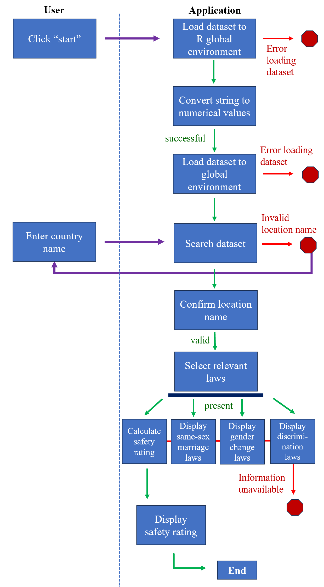

## How to Use LGBTQsafety App, with an Example Application 

Open a new file in R studio.
Install the R package from github, using the devtools::install_github function:

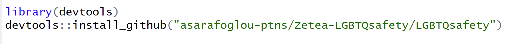{width="666" height="59"}

Ensure the following packages are installed and loaded: “shiny”, “bslib”, and “dplyr”.
You can also now load the package, using library(LGBTQsafety):

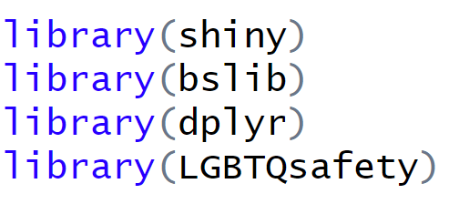{width="181"}

Run the application by using the open_app() function:

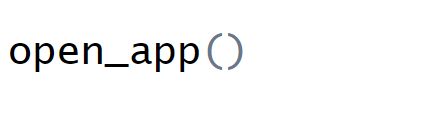{width="170"}

If this does not work, the package can also be downloaded directly from <https://github.com/asarafoglou-ptns/Zetea-LGBTQsafety>.
All functions, including open_app(), are present in the file Rpackage_functions.R, found in the R folder within the repository.

Once the application is opened, the user will see a dark purple screen with a title and short explanation at the top:

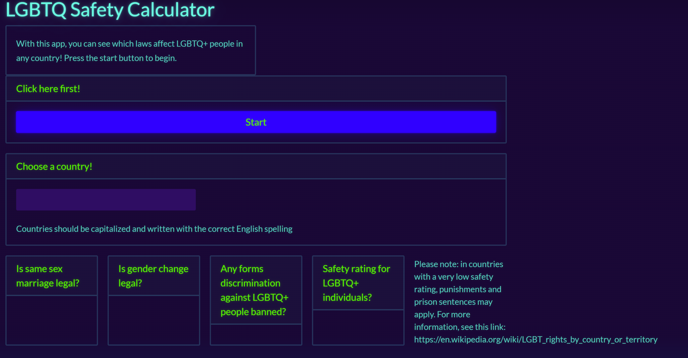

The explanation written at the top allows users to understand what the application is designed to do.

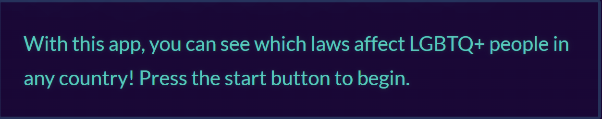

The user should first click the “start” button.
This will load the dataset which the application uses to display information about LGBTQ+ laws in different countries.
Pressing the “start” button also computes numerical values for columns containing data about whether homosexuality, same-sex marriage, and gender change are legal, along with anti-discrimination laws, which will be used to calculate the safety rating.

Next, users can enter a country to see which laws apply to LGBTQ+ individuals.
In order for the application to retrieve the data, countries must be capitalized and spelled correctly in English.

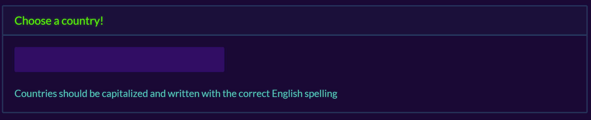

For example, if a non-existent country, “Narnia”, is entered, the application will inform the user that the country is not available.

.png)

However, if a correctly-spelled country such as “Equatorial Guinea” is entered, the application will display the following information:

.png)

The first box displays whether same sex marriage is legal or illegal in the chosen country.
In some cases, more detail is provided if there are exceptions to the law, such as foreign marriages being accepted.

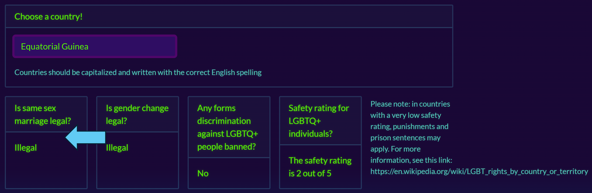

The second box displays whether gender change is legal or illegal in the chosen country.

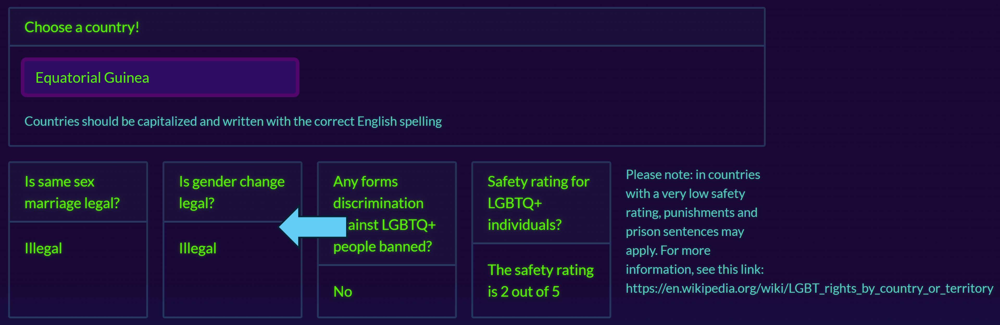

Some countries will also display conditions under which legal gender change is possible.
For example, in Romania, gender change is only legal with surgery and sterilization:

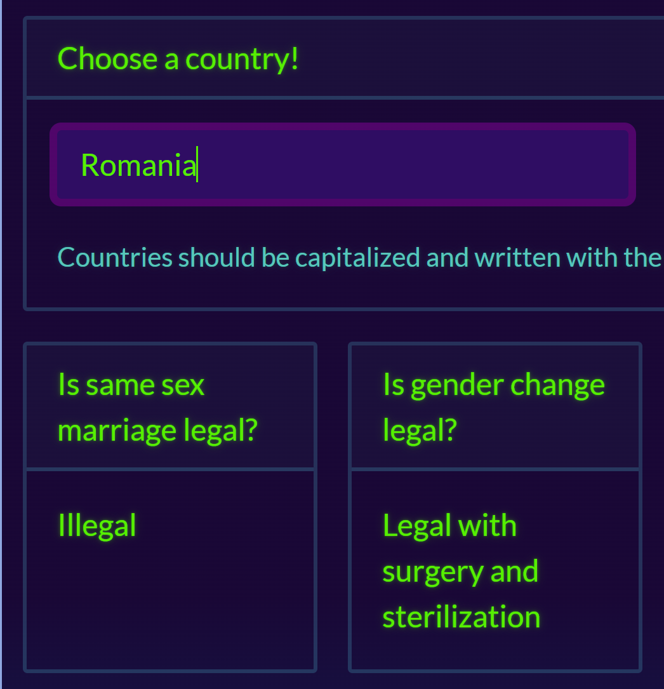

The third box displays whether the country has any laws banning discrimination towards LGBTQ+ individuals.
This may include laws banning all discrimination towards LGBTQ+ people (“all banned”), some forms of discrimination banned (“some”), or no laws banning discrimination, as is the case in Equatorial Guinea:

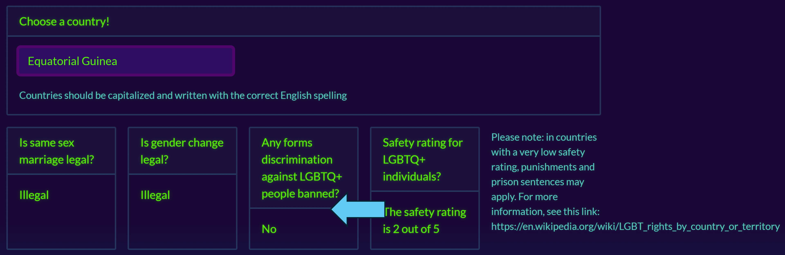

The final box displays the overall safety rating for LGBTQ+ individuals in the country.
This takes into account legality of homosexuality, same-sex marriage, gender change, and discrimination against LGBTQ+ individuals.
The rating is displayed on a scale from 1 to 5, with 5 indicating LGBTQ+ individuals have full legal rights and protections, and 1 indicating they have no rights or protection, and identifying as LGBTQ+ in this country may be a criminal offense.

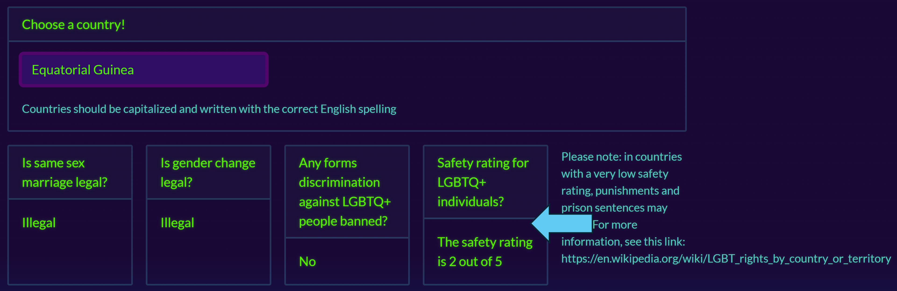

Finally, on the right of the fourth box, there is a note warning users to search for more information on countries with low safety ratings.
Users can follow the link to a Wikipedia page which displays more information about laws in different countries and territories.

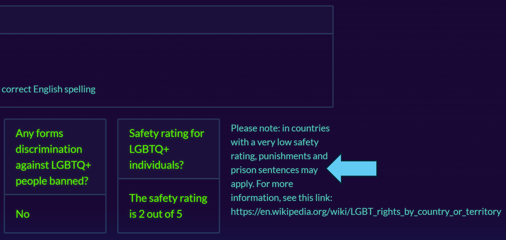

## References 

Wikipedia (Ed.).
(2024, May 28).
LGBT rights by country or Territory.
Wikipedia.
<https://en.wikipedia.org/wiki/LGBT_rights_by_country_or_territory>
